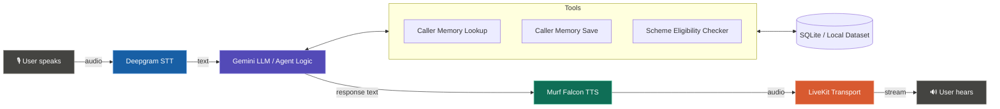

# Arthashathi

Arthashathi is a multilingual Indian voice-first financial assistant designed to help users understand government schemes, banking concepts, fraud prevention, and scheme eligibility through natural voice conversations. 

## Overview

Arthashathi is designed to make financial information easier to access through a conversational voice interface tailored for Indian users. It leverages state-of-the-art Voice AI to assist users with:

- Government welfare and financial schemes
- Banking concepts and processes
- Fraud and scam awareness/prevention
- Scheme eligibility checks
- Returning-user memory and conversational continuity
- Natural multilingual voice conversations

## Problem

Many Indian citizens struggle to navigate complex banking concepts, understand eligibility for government schemes, and protect themselves against financial fraud. Traditional text-based interfaces, complex government portals, and language barriers often prevent people from accessing the financial information and support they need. 

## Solution

Arthashathi bridges this gap by providing an intuitive, voice-first assistant. Users can simply speak to the agent in their native language to check scheme eligibility, learn about banking, or get advice on scam prevention. By remembering returning callers and maintaining context, Arthashathi acts as a personalized financial companion.

## Key Features

- **Voice-based interaction:** Complete hands-free conversational experience.
- **Gemini-powered conversational intelligence:** Advanced reasoning and natural dialogue generation.
- **Murf Falcon-powered voice output:** High-quality, ultra-low latency text-to-speech.
- **Speech-to-text using Deepgram:** Fast, accurate, multilingual speech recognition.
- **LiveKit voice communication:** Robust real-time audio transport.
- **Personalised frontend:** Custom financial-services UI built with Next.js.
- **Clear voice-agent states:** Visual indicators for Ready, Connecting, Listening, Speaking, and Call ended.
- **Microphone permission/error handling:** Graceful fallback and user prompts for mic access.
- **Multilingual Indian-language interaction:** Seamless support for multiple regional languages.
- **Natural code-switching:** Handles English banking terms seamlessly without breaking the regional language flow.
- **Mid-conversation language switching:** Agent dynamically adapts if the user switches languages mid-call.
- **Persistent SQLite memory:** Safely stores non-sensitive caller information across sessions.
- **Caller lookup & memory storage:** Retrieves previous context and asks for consent before saving new memories.
- **Returning-caller recognition:** Greets known users by name and references past topics natively.
- **Scheme eligibility checking:** Actionable tool to check qualifications for schemes like PM Awas Yojana.
- **Local scheme dataset:** Offline dataset of eligibility criteria.
- **Graceful handling of unknown schemes/errors:** Conversational fallbacks instead of system crashes.
- **Safety rules around sensitive financial information:** Strict guardrails preventing the storage of PII and credentials.

## How It Works / Architecture



## Voice Interaction

The system relies on LiveKit for real-time audio streaming, Deepgram for near-instant speech transcription, and Murf Falcon for human-like voice synthesis. The interaction feels like a real phone call, complete with natural pauses, conversational turn-taking, and active listening.

## Multilingual Support

Arthashathi is explicitly designed for Indian multilingual conversations. It currently supports:
- Bengali
- Hindi
- Tamil
- Telugu
- Marathi
- Gujarati
- Punjabi
- Kannada
- Malayalam
- Odia
- Assamese
- English

**Mid-conversation Switching:** The agent continuously follows the user's latest meaningful language. If a user starts in Hindi and then switches to Bengali mid-call, the agent will seamlessly switch to Bengali for its next response.

**Natural Code-Switching:** English banking terms inside Indian-language speech (e.g., *bank, account, UPI, ATM, PIN, OTP, CVV, fraud, scam, transaction, loan*) do not incorrectly cause a language switch. For example, *"Amar bank account e ekta fraud transaction hoyeche"* will correctly trigger a Bengali response, not English.

## Day-by-Day Development

### Day 1
Established the foundational voice agent using LiveKit, Murf Falcon TTS, and Deepgram STT. Configured the Gemini model as the conversational brain.

### Day 2
Implemented comprehensive system prompts and guardrails. Trained the agent on specific government schemes, fraud prevention protocols, and general banking concepts, establishing the core "Arthashathi" persona.

### Day 3 — Personalised Frontend
The generic LiveKit frontend was heavily personalised for Arthashathi's financial-services use case. Clear voice-agent states were implemented (Ready, Connecting, Listening, Speaking, Call ended) to make it obvious who is speaking. Microphone permission errors were cleanly handled, and the complete flow was tested from page load through connection and restarting.

### Day 4 — Persistent Memory
Built a persistent SQLite memory system so the agent can remember returning callers across backend restarts.
- `lookup_caller` retrieves existing information.
- `remember_caller` saves information learned during a conversation.
- The agent explicitly asks for consent before saving memory.
- Returning callers are proactively greeted by name with references to previous conversations.
- Strict safety rules prevent the storage of sensitive banking credentials.

### Day 5 — Scheme Eligibility Tool
Upgraded the agent from static knowledge to active tooling by implementing a Scheme Eligibility Checker.
The agent now uses a local dataset (`schemes_data.py`) to actively evaluate user-provided metrics (income, age, housing status) against scheme criteria, providing concrete eligibility answers instead of generic descriptions.

## Memory Architecture

The persistent memory is built on a local SQLite database (`arthasathi_users.db`). It uses a stable `caller_id` (derived from the LiveKit participant identity) to securely match callers.

Stored information includes:
- Name
- Language preference
- Relevant financial topics/facts discussed
- Last interaction timestamp

**Important:** The system explicitly filters out and refuses to store sensitive credentials (OTPs, PINs, Passwords, Bank Account numbers, Aadhaar/PAN). The memory is accessed via LLM tools (`@function_tool`), keeping the database cleanly separated from the prompt context.

## Scheme Eligibility System

### Data Source
The scheme eligibility checker uses a **LOCAL, HAND-BUILT dataset** located at `backend/src/schemes_data.py`. 
*Note: It does NOT use a live government API. There is no single unified, publicly accessible real-time API for Indian government scheme eligibility criteria.*

### What the dataset contains
- Scheme name
- Short benefit summary
- Concrete eligibility criteria (e.g., `max_annual_income`, `min_age`, `must_not_own_pucca_house`, `is_farmer`)
- `data_as_of` field indicating when the criteria were compiled.

### How it works
1. User asks whether they are eligible for a specific scheme.
2. Agent identifies the scheme and asks conversationally for any missing required information (e.g., income).
3. The agent does NOT guess missing info.
4. Agent calls `check_scheme_eligibility`.
5. The function performs fuzzy/substring matching on the scheme name and evaluates the provided information against the local dataset.
6. The result (eligible, not eligible, or missing information) is returned to the LLM and converted into a natural-language explanation.
7. Unknown schemes trigger a graceful conversational fallback without crashing the session.

## Technology Stack

- **Python** (Backend logic and Agent architecture)
- **LiveKit** (Real-time audio transport and WebRTC)
- **Gemini 3.1 Flash Lite** (LLM conversational engine)
- **Murf Falcon** (Ultra-low latency Text-to-Speech)
- **Deepgram** (Speech-to-Text)
- **SQLite** (Persistent memory storage)
- **Next.js / React** (Frontend UI)
- **TypeScript** (Frontend logic)

## Project Structure

```text
murf-livekit-starter/
├── backend/                 
│   ├── src/
│   │   ├── agent.py            # Agent entrypoint, LiveKit tools, pipeline setup
│   │   ├── prompt.py           # Arthashathi persona, language rules, guardrails
│   │   ├── database.py         # SQLite connection and memory queries
│   │   ├── schemes_data.py     # Local eligibility criteria dataset
│   │   └── arthasathi_users.db # Local SQLite database
│   ├── .env.local              # Backend credentials
│   └── pyproject.toml          # Python dependencies
├── frontend/                
│   ├── app/
│   │   ├── page.tsx            # Main application UI
│   │   └── api/token/          # LiveKit token generation endpoint
│   ├── components/             # React components for voice visualizers and state
│   ├── .env.local              # Frontend credentials
│   └── package.json            # Node dependencies
├── start_app.sh                # Start script (macOS/Linux)
└── README.md                   # This file
```

## Running the Project

### Prerequisites
- Python 3.10+ and `uv`
- Node.js 18+ and `pnpm`
- API Keys for LiveKit, Murf, Deepgram, and Google (Gemini)

### Start up
Add your API keys to `.env.local` in both `backend/` and `frontend/`.
Then run from the root directory:

```bash
chmod +x start_app.sh
./start_app.sh
```
Open **http://localhost:3000** in your browser, click **Start talking**, and allow microphone access.

## Testing

**Test Returning Memory:**
1. Start a call. "My name is Rahul. Tell me about loans. Please remember me."
2. End the call. Start a new call.
3. "Hi, I am Rahul."
4. *Expected:* The agent proactively greets Rahul and references the loan conversation.

**Test Scheme Eligibility:**
1. "Am I eligible for PM Awas Yojana?"
2. *Expected:* The agent asks for your income and housing status before determining eligibility.

**Test Graceful Failure:**
1. "Am I eligible for the Fake Spaceship Yojana?"
2. *Expected:* The agent politely informs you it doesn't have information on that scheme.

## Safety & Limitations

- **No Credentials:** The assistant does not request OTP, PIN, CVV, passwords, or other sensitive credentials.
- **Informational Only:** Scheme eligibility results are informational and must be verified through official sources. The assistant does not promise approval or guaranteed eligibility.
- **Data Freshness:** Local scheme criteria may become outdated. The local eligibility dataset is not a live government API.
- **Official Channels:** Users should always verify important financial decisions through official bank channels or government portals.

## Future Improvements

- Live official scheme data integrations where reliable government APIs become available.
- Expanded dataset covering more state and central government schemes.
- User authentication for production-grade identity and security.
- More robust per-user memory isolation.
- Forget/delete-my-memory user controls.
- RAG (Retrieval-Augmented Generation) over official scheme PDFs and documents.
- Low-bandwidth optimization for rural connectivity.
- Support for additional Indian languages and dialects.

## Challenge / Credits

Arthashathi was built as part of the **10 Days of Voice Agents** challenge.
It leverages **Murf Falcon** for high-quality, ultra-fast Indian voice generation. 

#VoiceForBharat
